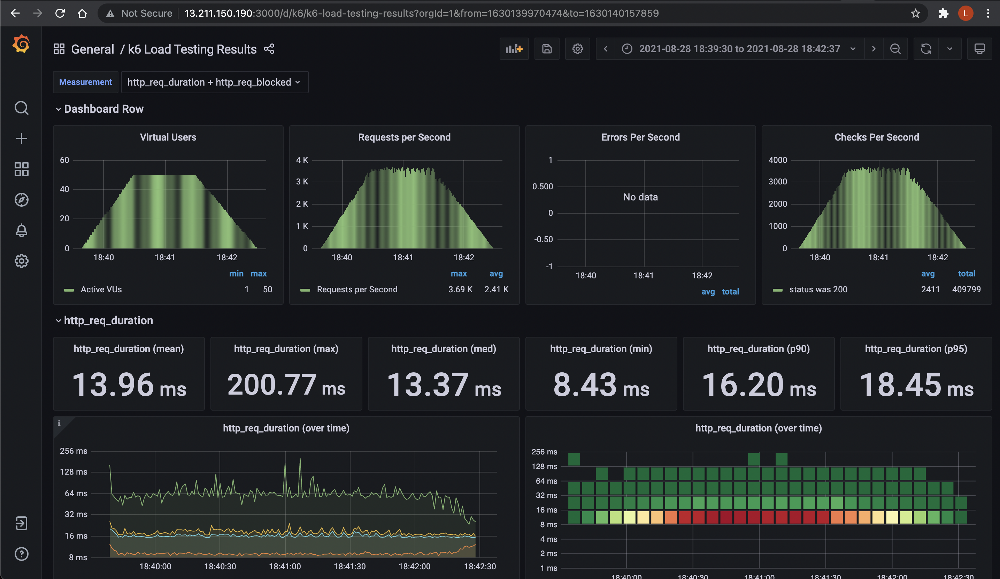

# aws-lambda-cpp
A C++ AWS Lambda implementation which implements the bootstrap specification for Lambda. 

## Published here:
https://services.mycodefu.com/c/mongodb

## Serverless

The project is deployed to AWS using Serverless:  
https://www.serverless.com/

Refer to the AWS guide for settings:
https://www.serverless.com/framework/docs/providers/aws/guide/serverless.yml/

Tried several load tests of the solution, and found that 1024MB RAM gave the sweet spot of performance to price.  
Less than 1024MB we found slower cold starts in th 2s+ range. Adding more RAM did not improve performance.

## Lambda
Specification:  
https://docs.aws.amazon.com/lambda/latest/dg/lambda-dg.pdf

## Load Test Result for Base C++ Bootstrap Only
Following script in K6 run from an m5.2xlarge EC2 instance in the same region:
```javascript
import http from 'k6/http';
import { check, sleep } from "k6";

export let options = {
    stages: [
        { duration: "5s", target: 5 },
        { duration: "5s", target: 10 },
        { duration: "5s", target: 15 },
        { duration: "5s", target: 20 },
        { duration: "5s", target: 25 },
        { duration: "5s", target: 30 },
        { duration: "5s", target: 35 },
        { duration: "5s", target: 40 },
        { duration: "5s", target: 45 },
        { duration: "5s", target: 50 },
        { duration: "60s", target: 50 },
        { duration: "60s", target: 0 }
    ]
};

export default function () {
    let res = http.get('https://services.mycodefu.com/c/cpp/hello');
    check(res, { 'status was 200': (r) => r.status == 200 });
}
```

Stats for roundtrip performance of C++ bootstrap lambda:
```
Mean (average): 13.96 ms  
Min: 8.43 ms  
Median: 13.37 ms  
p90: 16.20 ms  
p95: 18.45 ms  
Max: 200.77 ms  
````



## Compiling MongoDB C++ Driver
http://mongocxx.org/mongocxx-v3/installation/linux/